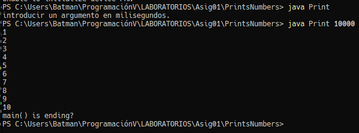
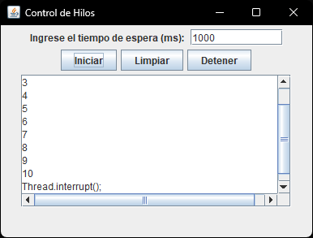
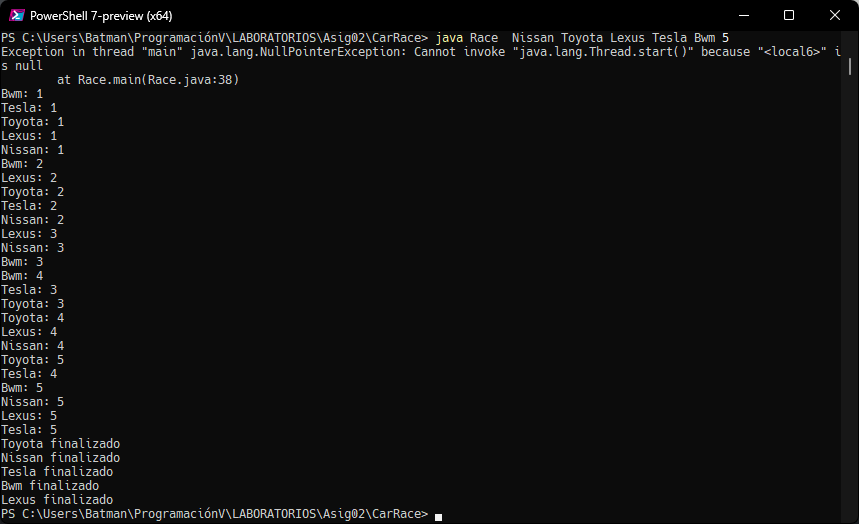

# Proyectos de laboratorio - Programación V
- Profesor de laboratorio: Álvaro Pino
## Descripción

Este repositorio contiene una serie de proyectos y laboratorios enfocados en la programación en Java, con un enfoque especial en la programación concurrente utilizando hilos. A continuación, se detalla el contenido de estos proyectos.

|          Titulo           | Proyecto         | Descripción                                                                                                                                                           |                   Demostración                    |
| :-----------------------: | :--------------- | :-------------------------------------------------------------------------------------------------------------------------------------------------------------------- | :-----------------------------------------------: |
|     Creating a Thread     | PrintsNumbers    | Creación de hilos por medio de interface Runnable. [CreatingThread](Asig01/PrintsNumbers/CreatingThread.md)                                                           |     |
|           -            | PrintsNumbersGUI | Interfaz gráfica con ventana, botones: iniciar, detener, limpiar.                                                                                                     |  |
| Simulating a Car Race  | CarRace          | Se verá como una carrera de carros que progresa despacio cuando UD le ve. El ganador será el hilo RaceCar que termine primero [RaceCar](Asig02/CarRace/CarRace.md) |             |
|             -             | CarRaceGUI       |                                                                                                                                                                       |                                                   |
|         TimerTask         |                  |                                                                                                                                                                       |                                                   |

## Uso

Para utilizar estos proyectos, asegúrate de tener instalado el entorno de desarrollo de Java (JDK)

## Contribución

Estoy abierto a sugerencias y contribuciones. Si tienes ideas para nuevos laboratorios o mejoras en los existentes, no dudes en realizar un pull request.
